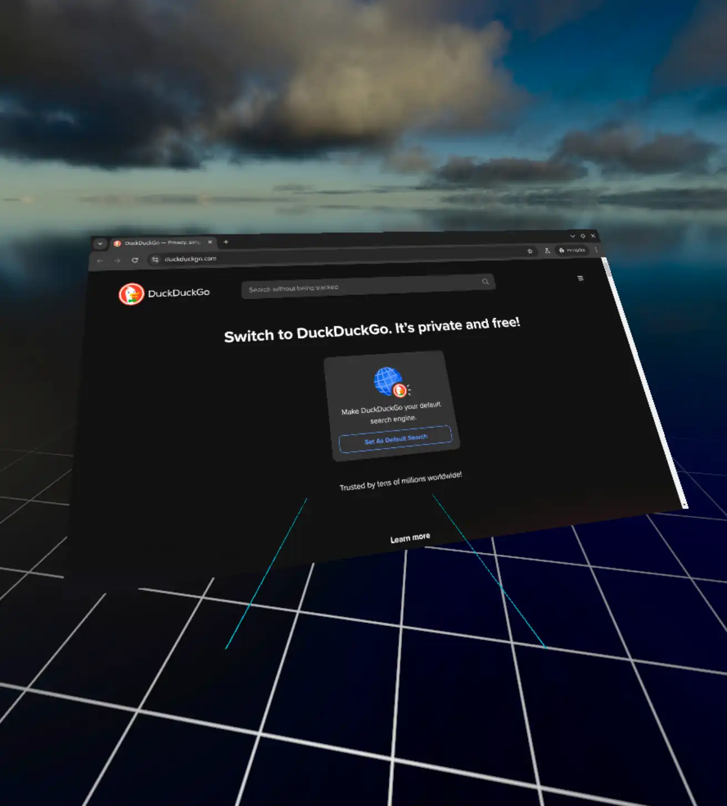

<p align="center">
	
</p>

**WayVR acts as a bridge between Wayland applications and wlx-overlay-s panels, allowing you to display your applications within a VR environment. Internally, WayVR utilizes Smithay to run a Wayland compositor.**


_Chromium browser in WayVR_

# Features

- Display Wayland applications without GPU overhead (zero-copy via dma-buf)
- Mouse input
- Precision scrolling support
- XWayland "support" via `cage`

# Installation

1. Clone [this fork of wlx-xoverlay-s](https://github.com/olekolek1000/wlx-overlay-s) repository and go to `wayvr` branch:

```
git clone --branch wayvr https://github.com/olekolek1000/wlx-overlay-s wlx
cd wlx
```

2. Change your startup application in `src/overlays/wayvr.rs` (search for `spawn_process`).

3. Start wlx-overlay-s: `cargo run`

# Roadmap

✅ - Done | 🚧 - WIP | 📌 - Planned

- [✅] Basic Wayland compositor renderer
- [✅] Mouse input support
- [🚧] Import mouse behaviour settings from wlx-overlay-s config (click freeze-time)
- [🚧] Basic cursor pointer rendering
- [📌] Spawn processes via config and customizable ui buttons directly from wlx
- [📌] CPU fallback in case if dma-buf is not available
- [📌] Show/hide support
- [📌] IPC between spawned processes and wlx-overlay-s for better integration (remote process spawning in separate compositors, access wlx info and internals)
- [📌] Keyboard input (and keyboard focus control in wlx)
- [📌] Proper window focus support (in case of multiple windows)
- [📌] Change window geometry
- [📌] Change compositor resolution on the fly
- [👀] Dedicated dashboard?
- [👀] Direct Gamescope support?

# Requirements

- Fork of wlx-overlay-s with WayVR support ([https://github.com/olekolek1000/wlx-overlay-s](https://github.com/olekolek1000/wlx-overlay-s))
- AMD graphics card (NVIDIA is not yet tested; feedback is welcome)
- `cage` is recommended for running XWayland applications

# Supported hardware

- Tested GPUs: AMD RX 7800 XT

- Your GPU here? (Let me know!)

# Supported software

- Basically all Qt applications (they work out of the box)
- Most XWayland applications via `cage`

# Known issues

- Due to unknown circumstances, dma-buf textures may display various graphical glitches due to invalid dma-buf tiling modifier. Please report your GPU model when filing an issue. Alternatively, you can run wlx-overlay-s with `LIBGL_ALWAYS_SOFTWARE=1` to mitigate that (Smithay compositor will be running in software renderer mode).

- Potential data race in the rendering pipeline - A texture could be displayed during the clear-and-blit process in the compositor, causing minor artifacts (no fence sync support yet).

- Even though some applications support Wayland, some still check for the `DISPLAY` environment variable and an available X11 server (looking at you, Chromium).

- GNOME still insists on rendering client-side decorations in 2024 instead of server-side ones. This results in all GTK applications looking odd due to additional window shadows.
